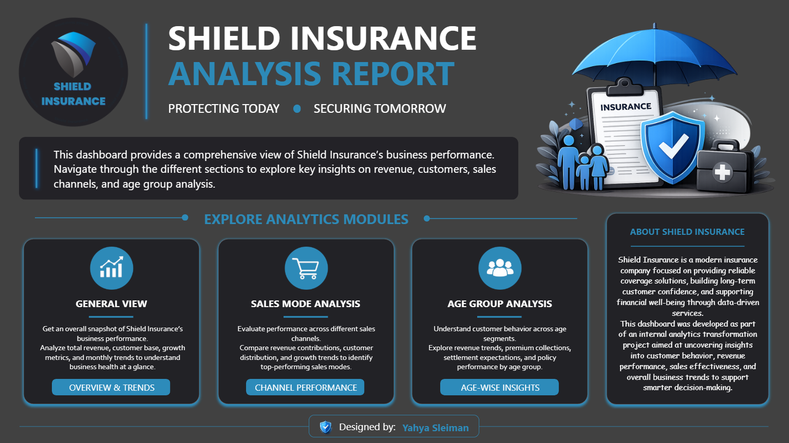
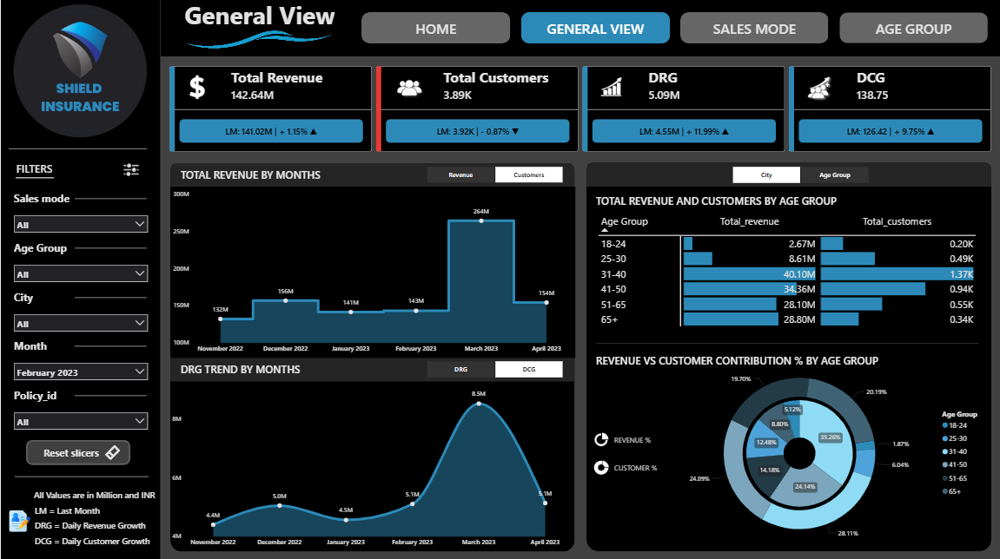
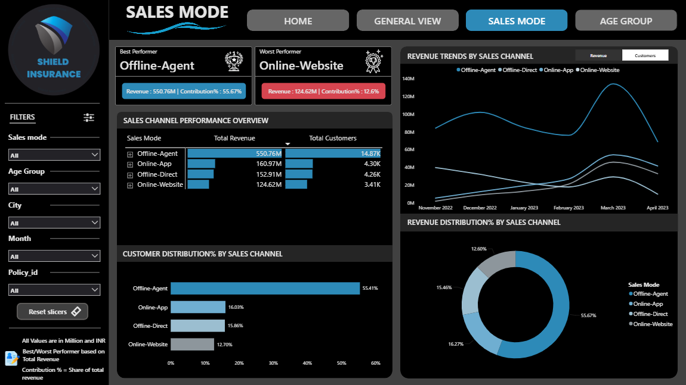
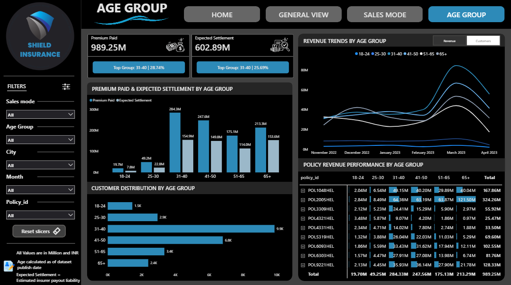
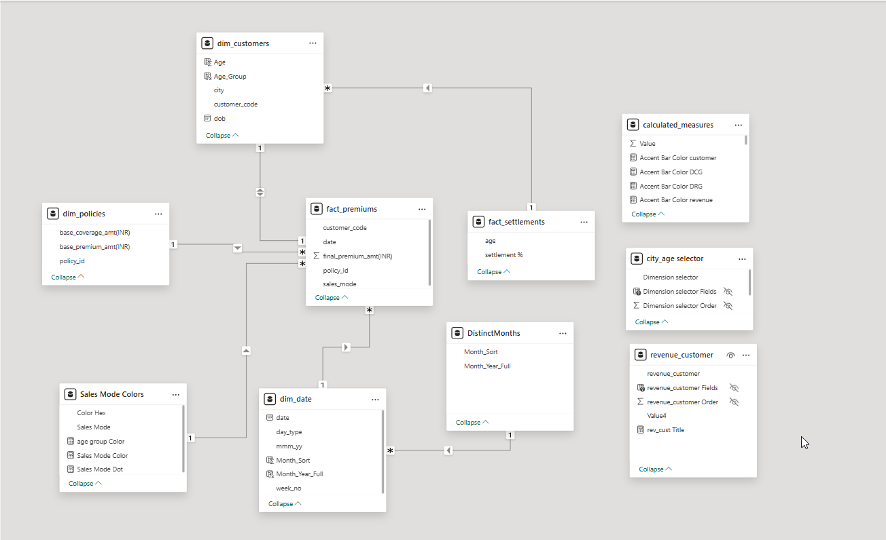

# Shield-Insurance : Business-Performance-Dashboard

A complete end-to-end analytics project focused on transforming raw business data into interactive insights and stakeholder-focused reporting.

---

🔗 **Live Dashboard Link**  
[Click here to view the Dashboard](https://app.powerbi.com/view?r=eyJrIjoiYjNkOGU2NGUtNTAwYy00YjEyLTk5YTQtOGIzM2MyNGRlYzA3IiwidCI6ImM2ZTU0OWIzLTVmNDUtNDAzMi1hYWU5LWQ0MjQ0ZGM1YjJjNCJ9&pageName=272372f9a00609542007)

---

## 📁 Project Overview
Shield Insurance is a customer-focused insurance provider operating across major cities and offering multiple policy solutions for different customer segments.

This project focuses on analyzing business performance through interactive dashboards designed to help stakeholders understand revenue trends, customer behavior, settlement exposure, sales channels, and growth opportunities.

This analysis focuses on:

- **Overall business performance**
- **Revenue and customer growth trends**
- **City-wise performance analysis**
- **Sales mode contribution**
- **Age-group segmentation**
- **Settlement analysis**
- **Business growth opportunities**
---

## 📸 Dashboard Pages & Screenshots

### **Home Page**  
A navigation page providing quick access to all dashboard sections.  

---

### **General View**  
A complete business snapshot showing total revenue, customer growth, KPI trends, demographic contribution, and overall performance analysis.  

---

### **Sales Mode Analysis**  
An analytical view comparing offline and digital sales channels, customer acquisition, and revenue contribution across different sales modes.  

---

### **Age Group Analysis**  
A demographic analysis dashboard showing customer distribution, revenue contribution, settlement exposure, and trend analysis across age groups.  

---

## 🗂️ Data Model Screenshot

A visual representation of the data model used to build the dashboard.  

---

## 🔍 Key Insights

- March 2023 showed the highest overall business performance in both revenue and customer acquisition.
- Delhi NCR and Mumbai generated the majority of overall business revenue.
- The 31–50 age segment contributed the largest share of revenue and customer base.
- Digital channels showed strong growth potential and stable contribution trends.
- Higher age groups contributed larger premium values but also higher settlement exposure.
- Younger customer segments showed long-term growth opportunities for digital insurance products.

---

## 🚀 Business Recommendations

- Expand digital sales channels to support scalable long-term business growth.
- Strengthen customer acquisition strategies in high-performing metro cities.
- Focus marketing efforts on the 31–50 age segment to maximize revenue potential.
- Build simplified digital products targeting younger customer demographics.
- Improve risk management strategies for high-settlement customer segments.

---

## 🛠️ Tech Stack

- **Power BI**
- **DAX**
- **Power Query**
- **SQL**
- **Excel**
- **Business storytelling**
- **Data visualization**

---

## 📚 Learnings

- Translating business requirements into interactive analytical dashboards.
- Building stakeholder-focused KPI reporting systems.
- Creating dynamic DAX calculations and parameter-driven visualizations.
- Applying business storytelling principles to dashboard design.
- Understanding real-world analytics workflow and reporting practices.

---

## ⚠️ Note

Original datasets are not included due to project confidentiality and internship guidelines.

---

## 👤 Author

**Yahya Sleiman**

🔗 LinkedIn: https://www.linkedin.com/in/yahya-sleiman-6b742a356
🔗 Portfolio: PASTE_PORTFOLIO_LINK
